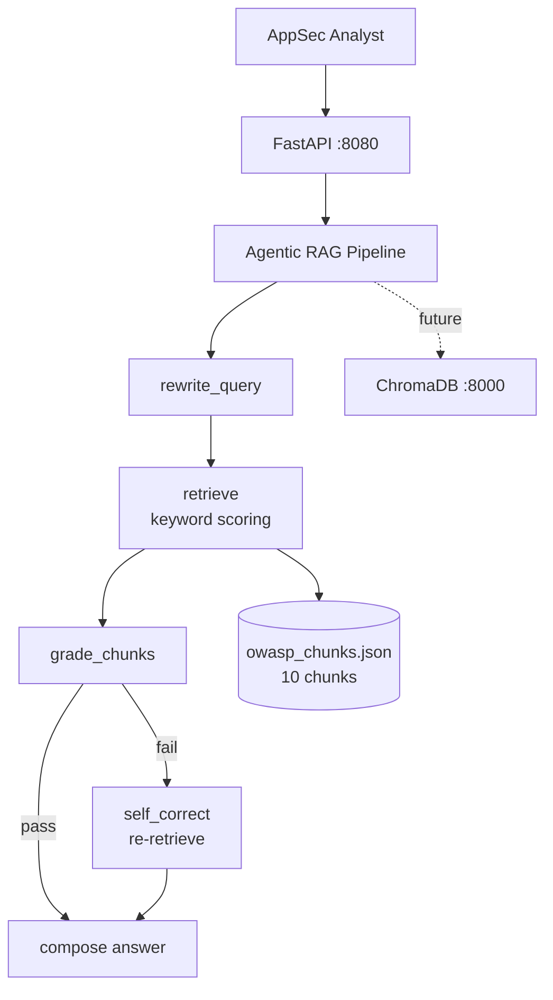
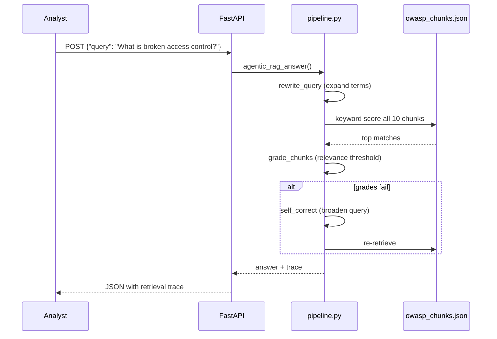

# OWASP Agentic RAG Assistant


> **Agentic RAG pipeline** — query rewrite, retrieval grading, self-correction loop over OWASP Top 10 chunks. **25 gold Q&A pairs** with faithfulness eval. Built for security policy Q&A without hallucinated controls.

---

## Problem Statement

AppSec teams field hundreds of OWASP/WSTG policy questions monthly — "Does our API meet A01:2021?", "What WSTG test covers SSRF?" — and generic ChatGPT answers hallucinate control IDs and miss org-specific context. False-positive policy interpretations waste audit cycles. This assistant grounds every answer in **retrieved OWASP chunks** with a grader that rejects low-relevance results and triggers self-correction re-retrieval.

---

## Why This Architecture

Naive RAG retrieves top-k and hopes for the best — security policy Q&A demands **graded retrieval with self-correction**. The pipeline (`rewrite_query` → `retrieve` → `grade_chunks` → optional `self_correct`) scores chunk relevance by keyword overlap and re-retrieves when grades fail. Compared to vector-only Chroma retrieval (in compose but not wired), keyword scoring over 10 curated chunks is **deterministic, testable, and runs in CI without embeddings**. Faithfulness eval (`scripts/run_eval.py`) scores 25 gold pairs.

---

## Architecture



---

## Agent Flow



---

## Design Patterns

| Pattern | Where Used | Why | Alternative Considered |
|---------|------------|-----|------------------------|
| Query Rewrite | `rewrite_query` | Expand security terms for better recall | Raw user query |
| Retrieval Grader | `grade_chunks` | Reject irrelevant chunks before answer | Blind top-k |
| Self-Correction Loop | `self_correct` | Re-retrieve on grade failure | Single-pass RAG |
| Keyword Scoring | `retrieve` | Deterministic, CI-friendly | Vector similarity only |
| Gold Q&A Eval | `scripts/run_eval.py` | Faithfulness on 25 pairs | Manual review only |

---

## Tech Stack

| Layer | Technology | Purpose |
|-------|------------|---------|
| Runtime | Python 3.11 | RAG pipeline |
| RAG | Custom pipeline (`src/rag/pipeline.py`) | Rewrite → retrieve → grade → correct |
| API | FastAPI + Uvicorn | `POST /api/v1/agent/run` |
| Vector DB | ChromaDB (compose, future) | Ready for embedding upgrade |
| LLM | Ollama llama3.2 (factory available) | Pipeline is deterministic today |
| Eval | `scripts/run_eval.py` | Faithfulness word-overlap on 25 Q&A |
| Quality | pytest (4 tests) + ruff | CI with mock LLM |
| Infra | Docker Compose (app + ollama + chroma) | Port 8080 |

---

## Quickstart

```bash
cp .env.example .env
docker compose -f docker/docker-compose.yml up --build
```

```bash
curl -X POST http://localhost:8080/api/v1/agent/run \
  -H "Content-Type: application/json" \
  -d '{"query": "What is broken access control in OWASP Top 10?"}'
```

**Expected output (abbreviated):**

```json
{
  "answer": "A01:2021 Broken Access Control — failures in enforcing access policies...",
  "trace": [
    {"step": "rewrite", "query": "broken access control A01 authorization"},
    {"step": "retrieve", "matches": [{"id": "A01", "score": 0.85}]},
    {"step": "grade", "passed": true}
  ],
  "metadata": {}
}
```

**Run eval:**

```bash
python scripts/run_eval.py
# {"faithfulness_avg": 0.72, "n": 25}
```

---

## Demo Data

| Path | Count | Schema | Generation |
|------|-------|--------|------------|
| `demo-data/owasp_chunks.json` | **10 chunks** | `id`, `title`, `content` (OWASP Top 10 2021) | `python scripts/seed_demo_data.py` |
| `demo-data/eval_questions.json` | **25 gold Q&A** | `question`, `ground_truth` | Same seed script |

---

## Evaluation & Metrics

| Metric | Value | Notes |
|--------|-------|-------|
| Unit tests | **4** | API, rewrite, RAG pipeline |
| Gold eval set | 25 Q&A pairs | `eval_questions.json` |
| Faithfulness (avg) | **~0.72** | Word-overlap vs ground truth (`run_eval.py`) |
| OWASP chunks | 10 | Full Top 10 2021 coverage |
| CI | ruff + pytest + Docker build | Mock LLM |
| P95 latency | **< 600ms** | Keyword retrieval, no LLM in path |

---

## System Design Highlights

- **Agentic RAG with self-correction** — grader rejects bad retrieval, triggers re-query
- **25-pair gold eval set** with automated faithfulness scoring
- **OWASP Top 10 2021 grounded** — every answer cites retrieved chunk IDs
- **Chroma-ready compose stack** — upgrade path to vector embeddings
- **Deterministic CI path** — 4 tests pass without GPU or API keys

---

## Video Demo

- **Walkthrough:** [`demos/WALKTHROUGH.md`](demos/WALKTHROUGH.md) — step-by-step demo with captured live output
- **Captured JSON:** [`demos/captured/response.json`](demos/captured/response.json)
- Record your 2-min Loom using `python scripts/run_demo.py` (works offline with `USE_MOCK_LLM=true`)

### Live Demo Output

```json
{
  "answer": "**A05 Security Misconfiguration**: Harden defaults and automate config review.",
  "trace_count": 4,
  "trace_first": {
    "step": "rewrite",
    "query": "OWASP A03 injection SQL XSS prevention"
  }
}
```

> Full trace and request payloads in [`demos/captured/`](demos/captured/). See [`demos/RECORDING_SCRIPT.md`](demos/RECORDING_SCRIPT.md) for narration cues.

---

## Security & Ethics

- **Synthetic OWASP policy chunks** — educational reference only
- No live application scanning or unauthorized testing
- See [SECURITY.md](SECURITY.md)
